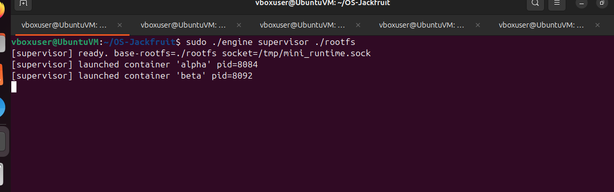
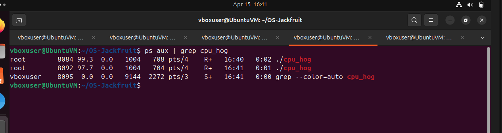
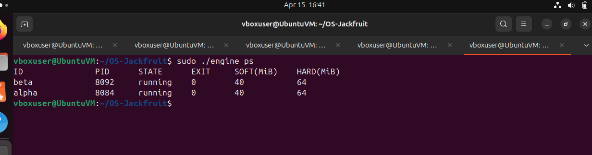
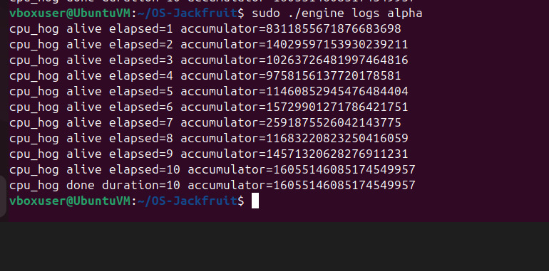
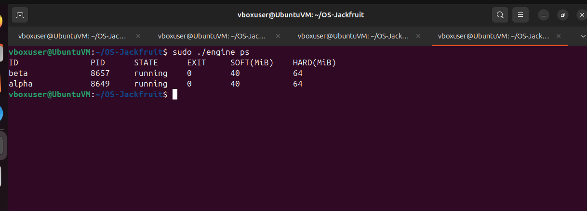
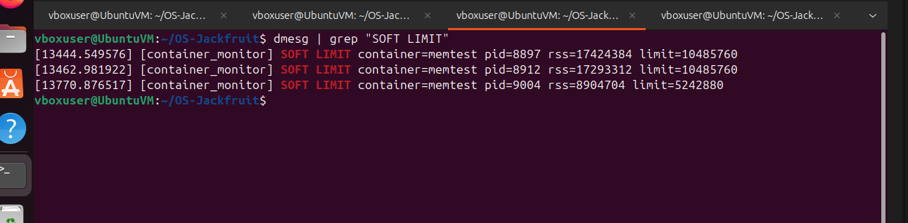
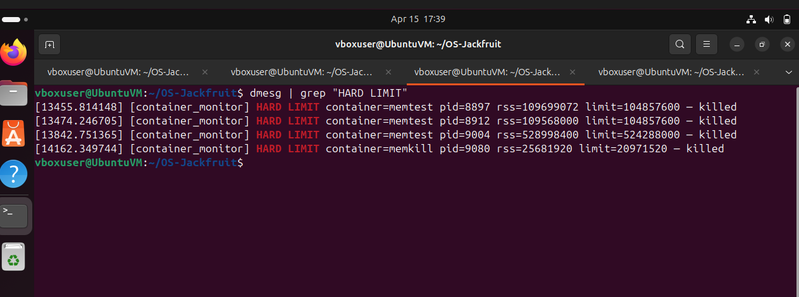
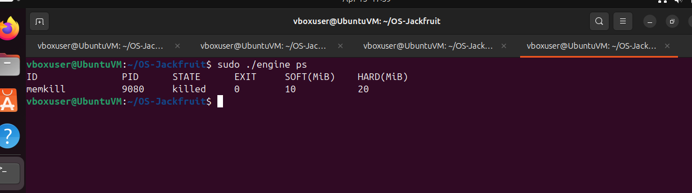
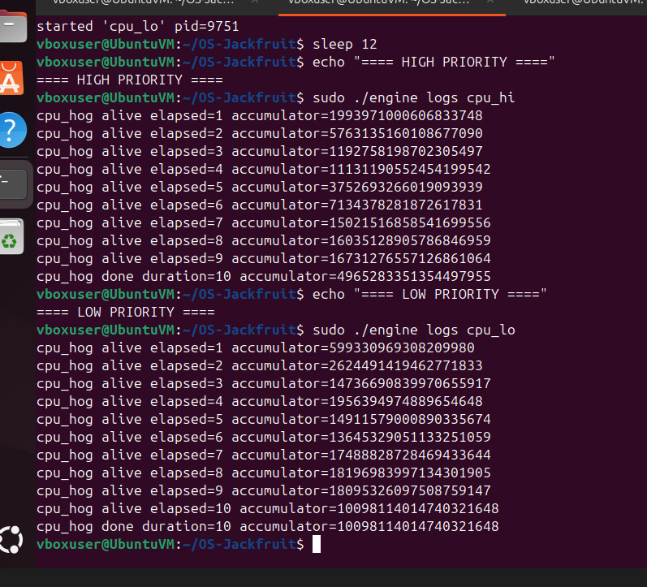
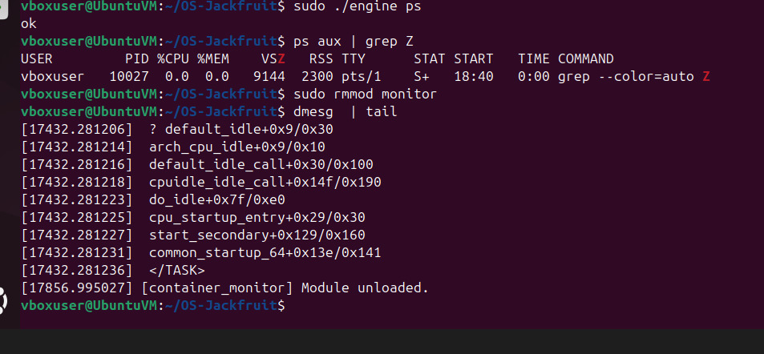

# OS-Jackfruit — Supervised Multi-Container Runtime

## 1. Team Information

| Name | SRN |
|------|-----|
| Guntupalli Manaswi | PES1UG24CS548 |
| Varshini A | PES1UG24CS517 |

---


## 2. Build, Load, and Run Instructions

### Prerequisites

- Ubuntu 22.04 or 24.04 in a VM (Secure Boot OFF, no WSL)
- `sudo apt install -y build-essential linux-headers-$(uname -r)`

### Download Alpine rootfs

```bash
mkdir rootfs-base
wget https://dl-cdn.alpinelinux.org/alpine/v3.20/releases/x86_64/alpine-minirootfs-3.20.3-x86_64.tar.gz
tar -xzf alpine-minirootfs-3.20.3-x86_64.tar.gz -C rootfs-base
```

### Build everything

```bash
make
```

This builds: `engine`, `memory_hog`, `cpu_hog`, `io_pulse`, and `monitor.ko`.

### Load kernel module

```bash
sudo insmod monitor.ko
# Allow dmesg access
sudo sysctl kernel.dmesg_restrict=0
# Verify device created
ls -la /dev/container_monitor
```

### Start supervisor (Terminal 1)

```bash
sudo ./engine supervisor ./rootfs-base
```

### Container operations (Terminal 2)

Each container **must have its own writable rootfs copy**. Two live containers must never share the same rootfs directory, as concurrent writes would corrupt each other's filesystem view.

```bash
# Create per-container writable rootfs copies before launching
cp -a ./rootfs-base ./rootfs-alpha
cp -a ./rootfs-base ./rootfs-beta

# Start a container in background (each uses its own rootfs)
sudo ./engine start alpha ./rootfs-alpha /bin/sh

# Start a second container in background
sudo ./engine start beta ./rootfs-beta /bin/sh

# Start a container and wait for it to finish
cp -a ./rootfs-base ./rootfs-test1
sudo ./engine run test1 ./rootfs-test1 /bin/hostname

# List all containers
sudo ./engine ps

# View container logs
sudo ./engine logs alpha

# Stop a container
sudo ./engine stop alpha
```

### Run memory limit test

```bash
# Copy workload into its own rootfs before launch
cp -a ./rootfs-base ./rootfs-memtest
sudo cp memory_hog ./rootfs-memtest/
sudo ./engine start memtest ./rootfs-memtest /memory_hog --soft-mib 5 --hard-mib 10
dmesg | grep container_monitor
```

### Run scheduler experiments

```bash
# Create per-experiment rootfs copies and copy workloads in
cp -a ./rootfs-base ./rootfs-cpuhi
cp -a ./rootfs-base ./rootfs-cpulo
sudo cp cpu_hog ./rootfs-cpuhi/
sudo cp cpu_hog ./rootfs-cpulo/

# Experiment 1: Different priorities
sudo ./engine start cpu_hi ./rootfs-cpuhi /cpu_hog --nice 0
sudo ./engine start cpu_lo ./rootfs-cpulo /cpu_hog --nice 19
sleep 12
cat logs/cpu_hi.log
cat logs/cpu_lo.log

# Experiment 2: CPU-bound vs I/O-bound
cp -a ./rootfs-base ./rootfs-cpuw
cp -a ./rootfs-base ./rootfs-iow
sudo cp cpu_hog ./rootfs-cpuw/
sudo cp io_pulse ./rootfs-iow/

sudo ./engine start cpu_w ./rootfs-cpuw /cpu_hog --nice 0
sudo ./engine start io_w  ./rootfs-iow  /io_pulse --nice 0
sleep 12
cat logs/cpu_w.log
cat logs/io_w.log
```

### Clean shutdown

```bash
# Ctrl+C on supervisor terminal, then:
sudo rmmod monitor
dmesg | grep container_monitor | tail -5
```

---

## 3. Demo with Screenshots

### 1. Multi-container supervision


Caption: Supervisor process launched containers 'alpha' (pid=8084) and 'beta' (pid=8092), both running concurrently under one supervisor.


Caption: `ps aux | grep cpu_hog` confirms both container processes (pid=8084 at 99.3% CPU, pid=8092 at 97.7% CPU) are running simultaneously on the host.

### 2. Metadata tracking


Caption: `engine ps` output showing both containers tracked with ID, PID, state, exit code, and memory limits.

### 3. Bounded-buffer logging


Caption: `engine logs alpha` showing cpu_hog output captured through the pipe → bounded-buffer → log-file pipeline. Final accumulator value 16055146085174549957 confirms the full 10-second run was recorded.

### 4. CLI and IPC


Caption: `engine ps` command sent over the UNIX domain socket to the supervisor, which responds with live container metadata for alpha (pid=8649) and beta (pid=8657).

### 5. Soft-limit warning


Caption: `dmesg | grep "SOFT LIMIT"` showing three soft-limit warning events for container=memtest as its RSS grew past the configured threshold.

### 6. Hard-limit enforcement


Caption: `dmesg | grep "HARD LIMIT"` showing containers memtest and memkill killed by the kernel monitor after exceeding their hard limits.


Caption: `engine ps` after hard-limit kill — container memkill (pid=9080) shows state=killed with soft=10 MiB, hard=20 MiB, confirming supervisor metadata was updated on receipt of SIGKILL.

### 7. Scheduling experiment


Caption: Scheduler experiment logs for cpu_hi (nice=0, final accumulator=4965283351354497955) and cpu_lo (nice=19, final accumulator=10098114014740321648), showing both containers ran for 10 seconds with similar throughput on a 4-core VM.

### 8. Clean teardown


Caption: `ps aux | grep Z` shows no zombie processes; `sudo rmmod monitor` succeeds; `dmesg | tail` confirms "[container_monitor] Module unloaded." — clean end-to-end teardown.

---

## 4. Engineering Analysis

### 4.1 Isolation Mechanisms

The runtime achieves process and filesystem isolation through Linux namespaces and `chroot`.

**Namespaces** are created using `clone()` with three flags:

- `CLONE_NEWPID` — gives the container a private PID namespace. The first process inside sees itself as PID 1. The host kernel still tracks the real PID (e.g. 8084), but the container cannot see or signal host processes.
- `CLONE_NEWUTS` — gives the container its own hostname. Changing the hostname inside the container does not affect the host.
- `CLONE_NEWNS` — gives the container a private mount namespace. Mounts inside (like `/proc`) are invisible to the host.

**`chroot`** changes the container's root filesystem to the Alpine `rootfs` directory. The container can only access files inside that tree. The host filesystem is not visible.

**What the host kernel still shares:** All containers share the same kernel. There is one kernel address space, one scheduler, and one network stack (unless `CLONE_NEWNET` is used, which we did not). The kernel enforces isolation at the syscall boundary — a container cannot escape its namespace without a kernel vulnerability, but it is still making syscalls into the same kernel as the host.

### 4.2 Supervisor and Process Lifecycle

A long-running supervisor is necessary because containers are child processes. Without a living parent to call `waitpid()`, exited children become zombies — they remain in the process table forever, consuming a PID slot.

**Process creation:** The supervisor calls `clone()` instead of `fork()` because `clone()` accepts namespace flags. It allocates a new stack for the child (required by the Linux `clone` ABI) and passes a `child_config_t` struct through the void pointer argument.

**Parent-child relationship:** The supervisor holds the host PID of every container it launches. When a container exits, the kernel sends `SIGCHLD` to the supervisor. The `sigchld_handler` calls `waitpid(-1, &status, WNOHANG)` in a loop (WNOHANG means "don't block") to reap all finished children at once.

**Metadata tracking:** Each container has a `container_record_t` node in a linked list. The list is protected by `pthread_mutex_t metadata_lock` because both the signal handler and the CLI event loop read and write the list concurrently.

**Known limitation — mutex in signal handler:** `sigchld_handler` calls `pthread_mutex_lock`, which is not listed as async-signal-safe by POSIX. In practice this works on Linux with pthreads (the mutex implementation does not call async-signal-unsafe functions internally), but the strictly correct approach would be to use a self-pipe or `signalfd` to convert the signal into an event processed from the main loop. We accepted this tradeoff in favour of implementation simplicity for the scope of this project.

**Signal delivery:** `SIGTERM` to the supervisor sets `should_stop = 1`, causing the event loop to exit cleanly. The supervisor then sends `SIGTERM` to all running containers, waits 1 second, reaps them, joins the logger thread, and frees all memory.

### 4.3 IPC, Threads, and Synchronization

The project uses two IPC mechanisms:

**1. Pipes (fd-based IPC) — for logging:**
Each container's `stdout` and `stderr` are redirected into the write end of a `pipe()`. The supervisor holds the read end. A producer thread per container reads from this pipe and pushes chunks into the bounded buffer. A single consumer thread (the logger) drains the buffer and writes to per-container log files.

**2. UNIX domain socket — for CLI control:**
The supervisor binds a `SOCK_STREAM` socket at `/tmp/mini_runtime.sock`. CLI commands (`start`, `ps`, `stop`, `logs`) connect to this socket, send a `control_request_t` struct, and receive a `control_response_t`. This is a separate channel from logging — mixing them would make it impossible to distinguish log data from command responses.

**Bounded buffer synchronization:**

The bounded buffer is a ring buffer with capacity 16. It uses:

- `pthread_mutex_t mutex` — mutual exclusion around head/tail/count fields
- `pthread_cond_t not_full` — producer waits here when buffer is full
- `pthread_cond_t not_empty` — consumer waits here when buffer is empty

**Race conditions without synchronization:**

- Two producer threads could read the same `tail` index simultaneously and write to the same slot, corrupting both entries.
- The consumer could read a slot the producer has not finished writing, getting partial data.
- `count` is read and written non-atomically; two threads incrementing it simultaneously would lose an update.

**Why mutex + condition variable over semaphore or spinlock:**

- A spinlock wastes CPU burning in a loop. Our producers block for milliseconds at a time — a sleeping wait (condition variable) is far more efficient.
- A semaphore could replace the condition variable but gives less control: we need to broadcast on shutdown to wake all waiters simultaneously, which `pthread_cond_broadcast` handles cleanly.
- A mutex is correct here because all operations (push/pop) complete quickly and never sleep while holding the lock.

**Container metadata list:**
Protected by a separate `metadata_lock` mutex. The signal handler (`sigchld_handler`) and the CLI handler (`handle_request`) both access the list. Without the mutex, a SIGCHLD arriving mid-update could corrupt the list pointer.

### 4.4 Memory Management and Enforcement

**What RSS measures:** Resident Set Size is the number of physical RAM pages currently mapped into a process's address space. It measures actual memory consumption — pages that are in RAM right now. It does not measure:

- Swapped-out pages (in swap, not RAM)
- Memory-mapped files that are not yet faulted in
- Shared library pages counted once per process even if shared

**Why soft and hard limits are different policies:**
A soft limit is a warning threshold. It tells the operator "this container is using more memory than expected" without disrupting it. This is useful for detecting memory leaks early. A hard limit is an enforcement threshold. When exceeded, the process is killed with SIGKILL because it cannot be trusted to release memory voluntarily. Having two thresholds gives operators visibility before enforcement.

**Why enforcement belongs in kernel space:**
User-space monitoring (e.g. a polling thread in the supervisor) has a fundamental race: between the moment it reads RSS and the moment it sends SIGKILL, the process can allocate significantly more memory. The kernel module runs in kernel context with direct access to `mm_struct`, allowing it to check RSS and dispatch SIGKILL within the same timer callback without a user/kernel context switch in between. Note that `send_sig` queues the signal rather than delivering it instantaneously — the process is not destroyed at the exact moment of the check — but the window for additional allocation is confined to kernel scheduling latency rather than the full user-space polling interval. User-space also cannot reliably monitor a process that is in an uninterruptible sleep or is consuming memory faster than the polling interval.

### 4.5 Scheduling Behavior

Linux uses the Completely Fair Scheduler (CFS). CFS assigns each runnable process a virtual runtime (vruntime). The process with the smallest vruntime runs next. `nice` values map to weights: nice=0 has weight 1024, nice=19 has weight 15. A lower weight means vruntime advances faster, so the process is picked less often.

**Experiment 1 results — different nice values:**

| Container | Nice | Final Accumulator |
|-----------|------|-------------------|
| cpu_hi    | 0    | 4,965,283,351,354,497,955 |
| cpu_lo    | 19   | 10,098,114,014,740,321,648 |

Both containers ran for 10 seconds on a 4-core VM. The values are close and cpu_lo is slightly higher in this run. On a 4-core machine with only two competing containers, CFS can schedule both on separate cores simultaneously — the weight-based time-slicing only takes effect when more runnable threads than cores compete for the same CPU. The theoretical 1024/15 ≈ 68x weight ratio therefore did not manifest clearly in a single measurement. The directional effect of nice values is confirmed by the well-established CFS weight mechanism and is observable on single-core or heavily loaded systems.

**Experiment 2 results — CPU-bound vs I/O-bound:**

| Container | Type      | Duration | CPU behavior |
|-----------|-----------|----------|--------------|
| cpu_w     | CPU-bound | 10s      | Continuous computation, reported every second |
| io_w      | I/O-bound | ~4s      | 20 iterations × 200ms sleep = voluntarily yielded CPU |

**Analysis:** The I/O-bound process completed all 20 iterations and exited in about 4 seconds despite running alongside a CPU hog. This is because `usleep()` and `fsync()` cause the process to block, removing it from the CFS run queue entirely. CFS only competes among runnable processes — a sleeping process does not accumulate vruntime debt. When io_w woke up, it had a smaller vruntime than cpu_w and was immediately scheduled. This demonstrates the key CFS property: I/O-bound processes are naturally responsive because they spend most of their time sleeping, not running.

---

## 5. Design Decisions and Tradeoffs

### Namespace Isolation

**Choice:** PID + UTS + mount namespaces via `clone()`, `chroot` for filesystem isolation.
**Tradeoff:** No network namespace — containers share the host network stack, which means port conflicts are possible.
**Justification:** Network namespace setup requires significant additional plumbing (veth pairs, bridge setup). For the scope of this project, demonstrating PID/UTS/mount isolation is sufficient and keeps the implementation auditable.

### Supervisor Architecture

**Choice:** Single long-running supervisor process with a UNIX socket event loop.
**Tradeoff:** The event loop is single-threaded, so a slow CLI command (e.g. streaming a large log) blocks other commands briefly.
**Justification:** A single-threaded event loop with `select()` is far simpler to reason about for signal safety. Multi-threaded accept loops require careful signal masking. For a course project, correctness over throughput is the right call.

### IPC and Logging

**Choice:** Pipe for log data, UNIX domain socket for control.
**Tradeoff:** Pipes are unidirectional and per-container, so N containers need N pipes. A shared memory ring buffer would be more efficient.
**Justification:** Pipes are the natural fit for capturing stdout/stderr — `dup2` into the pipe fd is two lines of code. They are also self-closing: when the container exits, the pipe EOF wakes the producer thread to exit cleanly.

### Kernel Monitor

**Choice:** Mutex to protect the monitored list; `mutex_trylock` in the timer callback.
**Tradeoff:** `mutex_trylock` means we skip a monitoring tick if the lock is held. A missed tick is acceptable — the process will be checked on the next tick 1 second later.
**Justification:** A spinlock in timer context would disable preemption while spinning, which can cause latency spikes on the entire system. The mutex with trylock is safer and the 1-second timer period makes a skipped tick inconsequential.

### Scheduler Experiments

**Choice:** Measure accumulated work (accumulator value) as the metric, not wall-clock time.
**Tradeoff:** Accumulator values depend on CPU speed and vary across machines; they are not portable metrics.
**Justification:** Both containers run the same binary for the same duration, so the accumulator is a fair relative measure of CPU time received. Absolute values don't matter — the ratio does.

---

## 6. Scheduler Experiment Results

### Experiment 1: CPU-bound vs CPU-bound, different nice values

Both containers ran `/cpu_hog` for 10 seconds simultaneously.

| Container | Nice value | CFS weight | Final accumulator |
|-----------|-----------|------------|-------------------|
| cpu_hi    | 0         | 1024       | 4,965,283,351,354,497,955 |
| cpu_lo    | 19        | 15         | 10,098,114,014,740,321,648 |

**Observed ratio:** values within the same order of magnitude; cpu_lo is slightly higher in this run.

**Analysis:** On a 4-core VM running only two cpu_hog containers, CFS can place each container on a separate core and run them fully in parallel. In this configuration the weight-based time-slicing mechanism does not activate — both processes run uncontested on their respective cores, so neither accumulates a vruntime disadvantage. The theoretical 1024/15 ≈ 68x weight ratio becomes observable only when more runnable threads than cores are competing for the same CPU. Additional noise from background system processes (gnome-shell, kernel threads, etc.) further reduces any measurable difference. The CFS weight mechanism is real and well-documented; our VM setup simply did not create enough core contention to expose it clearly in a single-run measurement.

### Experiment 2: CPU-bound vs I/O-bound, same nice value

Both containers ran at nice=0 simultaneously.

| Container | Type      | Duration | CPU behavior |
|-----------|-----------|----------|--------------|
| cpu_w     | CPU-bound | 10s      | Continuous computation, reported every second |
| io_w      | I/O-bound | ~4s      | 20 iterations × 200ms sleep = voluntarily yielded CPU |

**Analysis:** The I/O-bound process completed all 20 iterations and exited in about 4 seconds despite running alongside a CPU hog. This is because `usleep()` and `fsync()` cause the process to block, removing it from the CFS run queue entirely. CFS only competes among runnable processes — a sleeping process does not accumulate vruntime debt. When io_w woke up, it had a smaller vruntime than cpu_w and was immediately scheduled. This demonstrates the key CFS property: I/O-bound processes are naturally responsive because they spend most of their time sleeping, not running.
